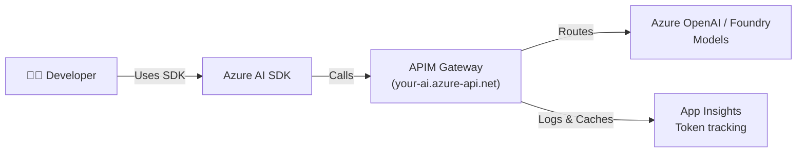

# Azure AI as a Managed Service: Enterprise Platform Guide

This repository contains the **definitive architecture and implementation patterns** for IT managers and platform engineers deploying Azure AI (LLMs, Agents, Evaluations) as a **governed, self-service platform** using:

- **Azure API Management (APIM)** - AI Gateway for cost control, security, and routing
- **Azure AI Foundry** - Agent Service, Model Hub, Evaluations  
- **Azure Application Insights** - Telemetry and observability
- **ServiceNow** - Provisioning workflow and quota management
- **Grafana** - Centralized dashboards for all AI Premium teams

## For IT Managers & Platform Engineers

👉 **Start here:** [Architecture Decision Records (ADRs)](docs/adr/) - Why we chose this approach

## For Developers

👉 **Start here:** [Developer Quick Start](docs/developer-quickstart.md) - How to build AI apps on this platform

## For Platform Engineers

👉 **Start here:** [Implementation Playbooks](docs/playbooks/) - Step-by-step setup

---

## What This Solves

| Challenge | Solution |
|-----------|----------|
| **Uncontrolled LLM costs** | APIM token quotas + semantic caching + chargeback models |
| **Security & compliance** | Centralized auth, audit logs, content safety policies |
| **Multi-team coordination** | ServiceNow provisioning, RBAC, quota governance |
| **No production observability** | Application Insights + Grafana dashboards per team |
| **Developer friction** | Simple SDK patterns, managed endpoints, no key distribution |

---

## Repository Structure

```
📁 docs/
   📄 developer-quickstart.md       ← Developers START HERE
   📁 adr/                           
      📄 adr-001-why-apim.md
      📄 adr-002-foundry-integration.md
      📄 adr-003-servicenow-workflow.md
   📁 playbooks/
      📄 setup-apim-gateway.md
      📄 setup-foundry-hub-project.md

📁 examples/
   📁 python/
      📄 1-simple-chat-via-apim.py
      📄 2-agent-with-tools.py
      📄 3-foundry-project-client.py
   📁 csharp/
      📄 1-agent-framework-apim.cs
      📄 2-project-client-setup.cs

📁 infrastructure/
   📁 bicep/
      📄 apim-gateway.bicep
      📄 foundry-hub-project.bicep
      📄 app-insights-setup.bicep

📁 policies/
   📁 apim/
      📄 token-quota-by-department.xml
      📄 semantic-caching.xml
      📄 auth-header-validation.xml
```

---

## Quick Concepts

### Developer Workflow



### What Developers See

- **One APIM subscription key** (no model keys)
- **Three API products:**
  - `/ai/inference` - Model calls (GPT-4, etc.)
  - `/ai/agents` - Agent Service (create, run threads)
  - `/ai/completions` - Simple chat interface
- **Managed identity auth** (no secrets in code)

---

## Getting Started

### For Developers

```python
# 1. Use APIM endpoint instead of direct Azure OpenAI
from azure.ai.projects import AIProjectClient
from azure.identity import DefaultAzureCredential

client = AIProjectClient(
    credential=DefaultAzureCredential(),
    project_id="your-project-id",
    # Point to your APIM gateway instead of direct Azure OpenAI
    endpoint="https://your-apim.azure-api.net"  
)

# 2. Work with agents the same way
agents_client = client.agents
agent = agents_client.create_agent(name="my-agent", model="gpt-4o")
```

See [Developer Quick Start](docs/developer-quickstart.md) for more.

### For IT Managers

1. **Deploy APIM gateway** → [setup-apim-gateway.md](docs/playbooks/setup-apim-gateway.md)
2. **Set up Foundry Hub Project** → [setup-foundry-hub-project.md](docs/playbooks/setup-foundry-hub-project.md)  
3. **Configure ServiceNow provisioning** → [servicenow-workflow.md](docs/playbooks/servicenow-workflow.md)
4. **Deploy observability stack** → [Grafana dashboards](infrastructure/bicep/)

---

## Key Features

✅ **Cost Control** - Token quotas per department/app  
✅ **Semantic Caching** - Reduce token costs by ~40% for repeated queries  
✅ **Auto-Failover** - Circuit breaker for rate limits (429)  
✅ **Audit Trail** - Every prompt + completion logged  
✅ **Managed Auth** - No API keys distributed to developers  
✅ **Multi-Region Support** - Load balance across Azure regions  
✅ **Chargeback Model** - Track spend by LOB, department, or cost center  

---

## Support & Questions

- 📖 [Architecture Decision Records](docs/adr/) - Why we chose each component
- 🛠️ [Implementation Playbooks](docs/playbooks/) - Step-by-step guides
- 💻 [Code Examples](examples/) - Real developer samples
- 📊 [Cost Models](docs/reference/cost-models.md) - Pricing & chargeback

---

**Last Updated:** Feb 2026  
**Maintained by:** Platform Engineering Team
